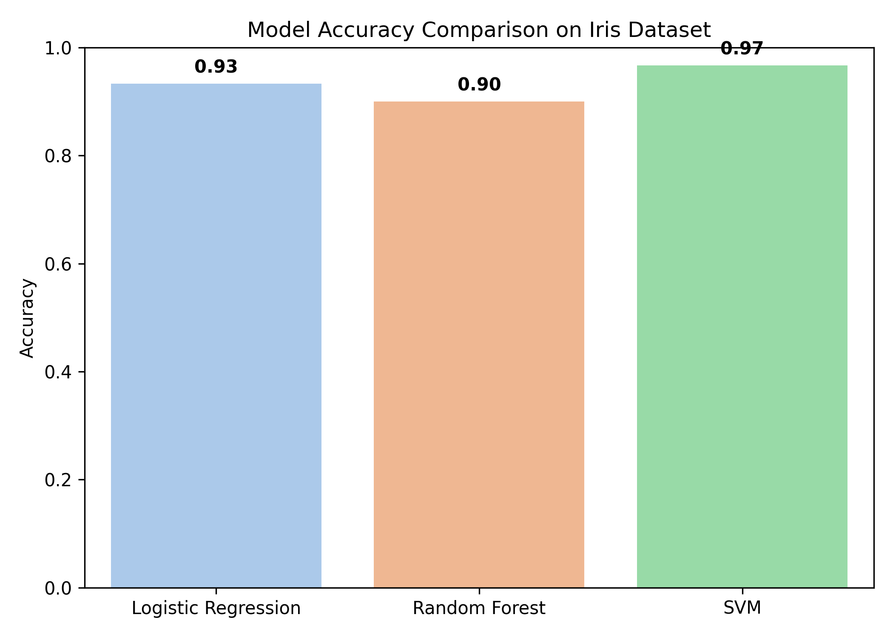
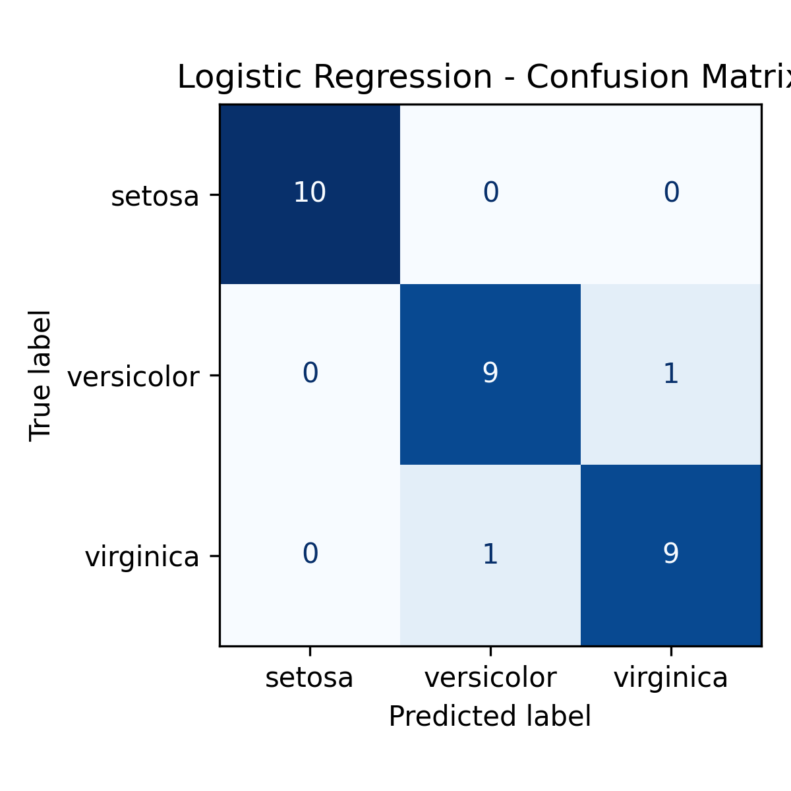
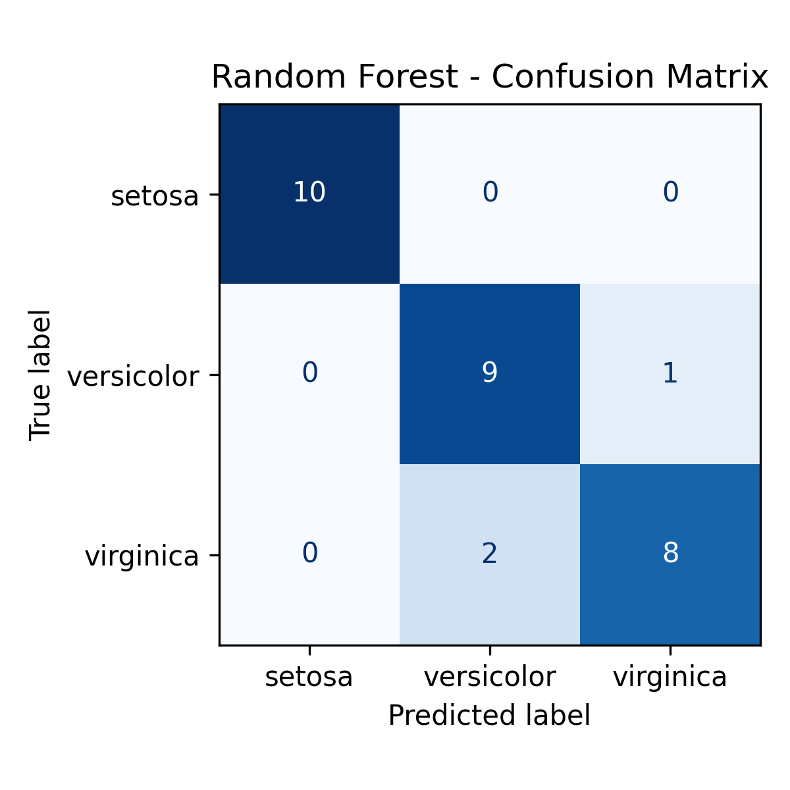
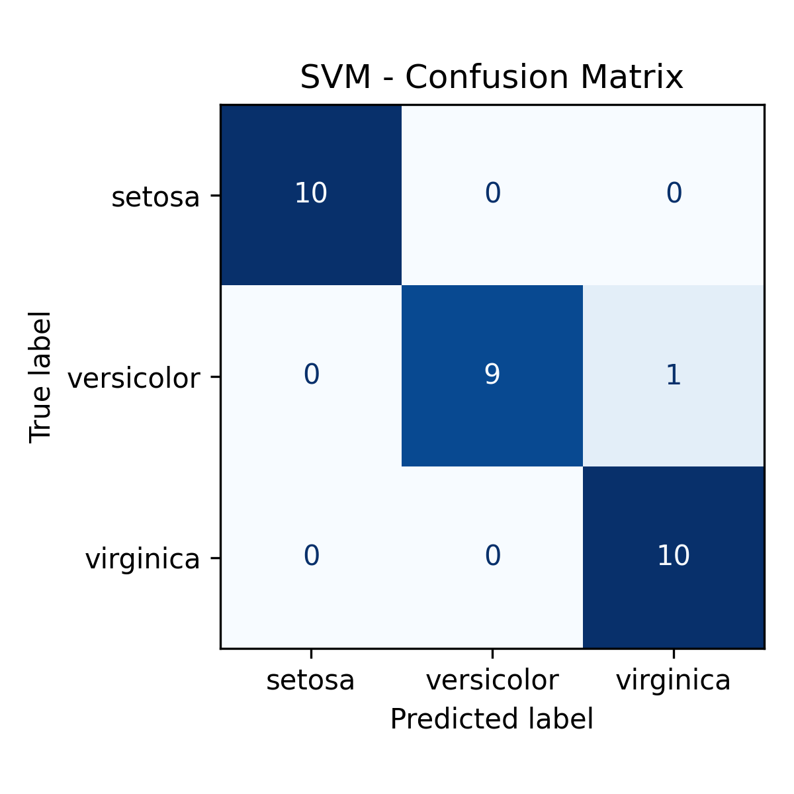

# comparative-ml-models-iris
“Comparison of Logistic Regression, Random Forest, and SVM on the Iris dataset with accuracy and confusion matrix visualizations.”
# Comparative Machine Learning Models – Iris Dataset

## 📌 Overview
This project compares **Logistic Regression**, **Random Forest**, and **SVM** classifiers on the classic **Iris dataset**.  
It demonstrates data preprocessing, model training, accuracy evaluation, and confusion matrix visualization.

---

## 🛠 Tools & Libraries
| Purpose            | Library         |
|--------------------|----------------|
| Data handling      | pandas, numpy   |
| Visualization      | matplotlib, seaborn |
| ML models          | scikit-learn    |

---

## 📊 Results

| Model               | Accuracy (example) |
|---------------------|------------------:|
| Logistic Regression  | 0.97              |
| Random Forest        | 0.98              |
| SVM                  | 0.97              |

### Accuracy Comparison


### Confusion Matrices
  
  


---

## ▶ Usage
1. Clone the repo:  
   ```bash
   git clone https://github.com/<your-username>/comparative-ml-models-iris.git

